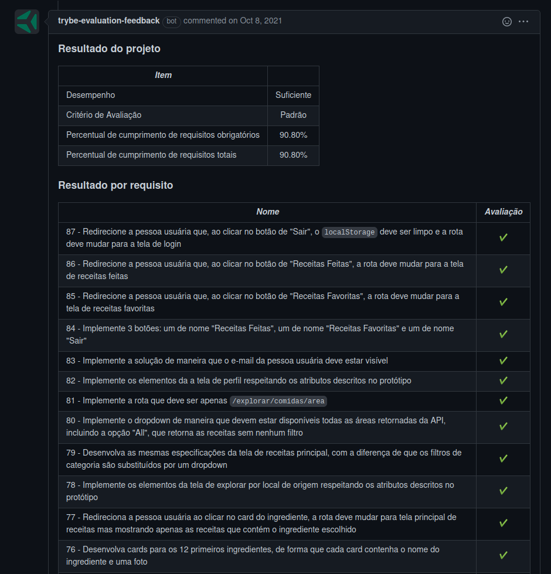
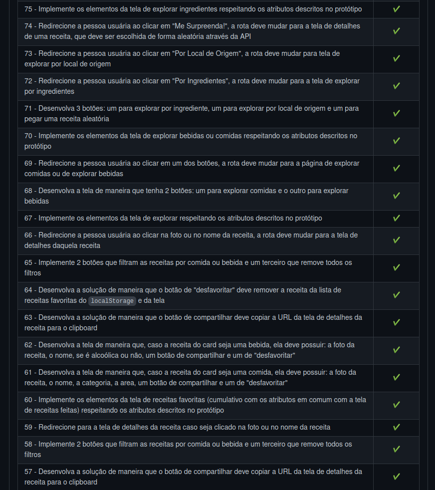
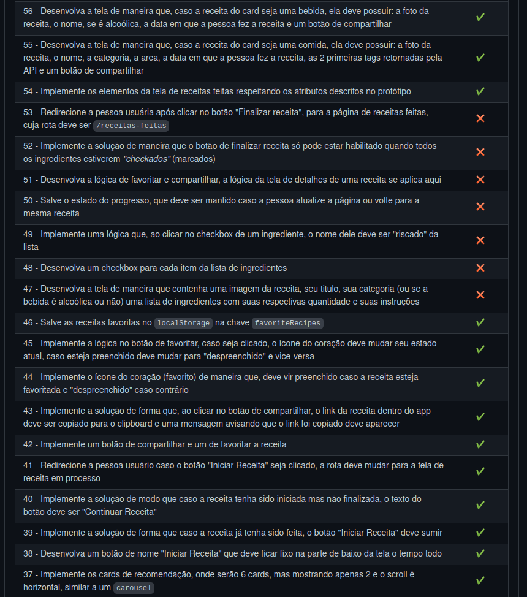
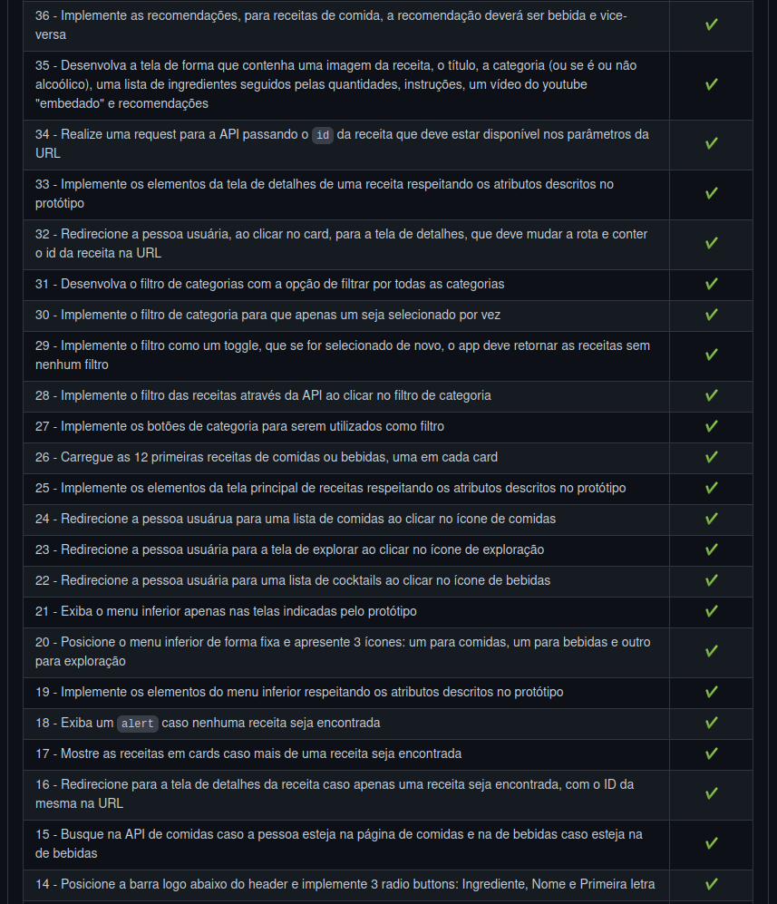
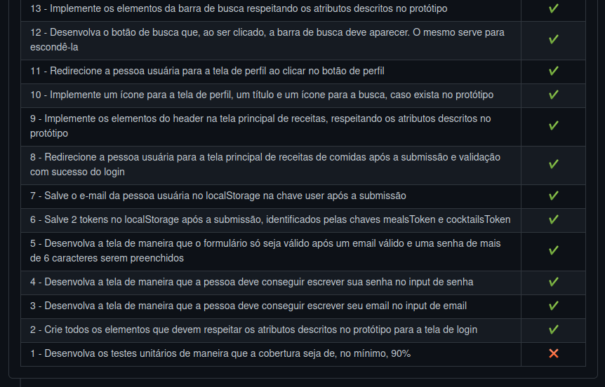

# Welcome to the Recipe APP

## Context

This project was made as a work assignment in during the Trybe web developer course.

The goal was to create a fully operational recipes app, using two diferent API's, and fully utilize the learnings from the frontend module.

---

## How to install

For this project, you will need to have installed:
- NPM

Copy the ssh from the project `git@github.com:luciobj/Project-Recipes-App.git`

* Open a terminal int your machine and type the following commands in ordedr:

  * `git clone git@github.com:luciobj/Project-Recipes-App.git`
  * `cd Project-Recipes-App`
  * `npm install`
  * `npm start`

  The app shoud run on the port 3000, and open a window on you default browser, fully operational.

---

## Development

This project was developed using the TDD method by my part, while my colegues opted for doing the tests after the features were fully completed. Also, we used Kanban and Scrum tecninques during the development.

### Tecnologys

In this project the focus was solely on frontend development, and as such the tecnologys used were React and Jest.

---

## Evaluator Results

This is a screenshot of the last run of the Trybe evaluator, which scores the demands of the project.

<!-- Este README foi inspirado por [Paulo](https://github.com/pauloricardoz)